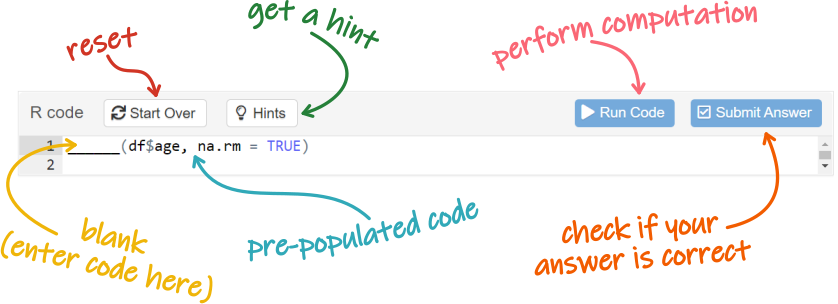

<base target = "_blank"> 

<style>
p.caption {
  font-size: 0.85em; 
}
</style>

```{r setup, include = FALSE}

library(learnr)
library(gradethis)
library(tidyverse)
library(knitr)

all_data <- read.csv2("data/tutorial_data.csv") 

# set plot theme to slightly lighter gray 
theme_set(theme_bw() %+replace% 
            theme(panel.background = element_rect(fill = "gray97")))

# tutorial options
tutorial_options(
  # globally disable code completion
  exercise.completion = FALSE,
  # code running in exercise times out after 2 min
  exercise.timelimit = 120,
  # use gradethis for checking
  exercise.checker = gradethis::grade_learnr
)

# hide non-exercise code chunks
knitr::opts_chunk$set(echo = FALSE)
```


<a rel="license" href="http://creativecommons.org/licenses/by-nc-sa/4.0/"></a> This tutorial was created by Nuria Doñamayor and Lara Wieland, and is licensed under a <a rel="license" href="http://creativecommons.org/licenses/by-nc-sa/4.0/">Creative Commons Attribution-NonCommercial-ShareAlike 4.0 International License</a>.


## Data analysis with R tutorial

### Relating AUDIT scores with the percentage of hits in the 2-back condition of both patients and healthy controls

In this tutorial, you are going to analyze the data you have acquired over the past few days (aggregated with those of the past semesters).

Specifically, you will correlate the **scores in the Alcohol Use Disorders Identification Test (AUDIT)** (auditSum) with the **percentage of hits in the 2-back condition** (X2backHitPerc) of an N-back task. The percentage of hits is calculated based on the ratio between correct responses (hits) and [false alarms](https://dictionary.apa.org/false-alarm). This correlation will use the data from both psychiatric patients and healthy controls. You will go through all necessary steps to end up with a meaningful output that you can report in a scientific way.


```{r fig1, echo = FALSE, out.width = "90%", fig.align = "center", fig.cap = "Artwork from [@juliesquid](https://twitter.com/juliesquid) for [@openscapes](https://twitter.com/openscapes) (illustrated by [@allison_horst](https://twitter.com/allison_horst)), licensed under [CC BY 4.0](https://creativecommons.org/licenses/by/4.0/)"}

knitr::include_graphics("https://github.com/allisonhorst/stats-illustrations/blob/main/openscapes/environmental-data-science-r4ds-general.png?raw=true")

```


### How to use this tutorial

As you might imagine, the structure of these data analysis tutorials is similar to that of last week's tutorials. However, there are a couple of differences that we'll point out now. 

Once again, every subsection will start with some introductory information that might contain some [links](https://techterms.com/definition/hyperlink). Some of the links are there to help you out with concepts with which you might not be thoroughly acquainted, but crucially others will take you to further info you might want to use in tomorrow's presentation. So do check out the links as they might come in quite handy.

Since you're going to be analyzing the data you acquired, you're obviously going to have to do some coding. You are probably quite familiar with this already, but here's a reminder just in case. 

<div class = "exercise_instruction"> 

Coding exercises will be preceded by brief instructions. We have used a different font and color from the rest of the text so you cannot miss them. 

</div> 

```{r fig2, echo = FALSE, out.width = "75%", fig.align = "center"}



```

Exercises will contain pre-populated code with blanks that you need to fill in. Once you're done, you can "run" the code and see your results. Some of the exercises also include hints and/or have a specific correct answer, in which case you'll see those additional buttons. Keep in mind how your variables are called and feel free to label your plot axes as you prefer. 

<div class = "hot_tip">

**TIP**

You're already familiar with this kind of tips. There won't be a lot of these in this tutorial.  

</div>

<p></p>

<div class = "presentation_tip">

**PRESENTATION TIP**

But this tutorial also has a bunch of presentation tips.

These tips suggest topics and ask questions you might wish to consider when you prepare tomorrow's presentation. These are not things you must answer, just stuff you might want to think about. 

</div>

<p></p>

Finally, every once in a while you will get asked specific questions about your findings. 

```{r how-to-question}

question(

  "Aren't quizzes awesome?",

  answer("I'm going to ace all the questions!", correct = TRUE),
  answer("Oh, no, not again!"),

  allow_retry = TRUE,
  random_answer_order = TRUE,

  correct = "Of course you will!",
  incorrect = "Simply pay close attention to your results and you'll be fine!"

)

```

Fantastic, let's start with some info about the AUDIT and N-back task!


### What is the Alcohol Use Disorders Identification Test?

The [**AUDIT**](https://www.who.int/publications/i/item/WHO-MSD-MSB-01.6a) is a 10-item questionnaire designed to [screen](https://dictionary.apa.org/screening-test) for alcohol use disorders. It has both an interview version and a self-report version.

The AUDIT screens the domains of hazardous alcohol use (*How often do you have a drink containing alcohol?*), dependence symptoms (*How often during the last year have you found that you were not able to stop drinking once you had started?*) and harmful alcohol use (*How often during the last year have you had a feeling of guilt or remorse after drinking?*). Each of the 10 items is scored between 0 and 4 points, with higher AUDIT scores indicating increased alcohol use severity. Scores above 20 warrant referral to a specialist for diagnostic evaluation and treatment.

The AUDIT has been translated to numerous languages, including German, and is widely used to screen for alcohol use disorders in a multitude of clinical settings, especially in the context of primary care. It has high  [reliability](https://dictionary.apa.org/reliability) and good [sensitivity](https://dictionary.apa.org/sensitivity), albeit lower [specificity](https://dictionary.apa.org/specificity), for current ICD-10 alcohol use disorders as well as the risk of future harm.


### What is the N-back task?

The [**N-back task**](https://www.psytoolkit.org/experiment-library/nback2.html) is often used to assess [working memory](https://dictionary.apa.org/working-memory) capacity in psychology and cognitive neuroscience. Participants are presented with a sequence of stimuli (e.g. letters or numbers) and are asked to press a button whenever the current stimulus is identical to the one from N steps prior. The factor N will determine the difficulty of the task and the working memory involvement necessary to perform it.

In the version we used, participants completed two conditions: 0-back and 2-back. In the 0-back condition, participants were asked to press a button whenever they saw a specific letter. In the 2-back condition, participants were asked to press a button whenever the current letter was identical to the letter presented two steps prior.


```{r fig3, echo = FALSE, out.width = "90%", fig.align = "center", fig.cap = "Example of a verbal N-back task: In the 0-back condition, the letter X serves as a target throughout the task; in the 1-back condition, any letter identical to the previous one is the target; in the 2-back condition, any letter identical to the one two trials prior is the target (figure from Vermeij et al. Effects of aging on cerebral oxygenation during working-memory performance: A functional near-infrared spectroscopy study. *PLoS ONE* 2012; 7(9): e46210. doi: [10.1371/journal.pone.0046210](https://journals.plos.org/plosone/article?id=10.1371/journal.pone.0046210), licensed under [CC BY 4.0](https://creativecommons.org/licenses/by/4.0/))."}

knitr::include_graphics("https://journals.plos.org/plosone/article/figure/image?size=large&id=10.1371/journal.pone.0046210.g001")

```


###

<div class = "presentation_tip">

**PRESENTATION TIP**

Compared to the 0-back condition in the N-back task, do you think the 2-back condition is easier or harder? 

How much working memory involvement would you expect in the 2-back condition?

</div>


## Formulating your hypothesis

The first step when conducting an experiment is formulating a [**hypothesis**](https://dictionary.apa.org/hypothesis) that is both testable and [falsifiable](https://dictionary.apa.org/falsifiability). This initial query will drive your experimental design, decisions regarding recruitment etc.

Obviously, in this module, we took care of experimental design and recruitment for you. Still, you chose to correlate AUDIT scores and percentage of hits in the 2-back condition, so you probably have some idea about why this could be interesting. Before you dive into data analysis, take a few minutes to consider what results you would expect, based on common sense and the clinical knowledge you acquired in this module.


<div class = "presentation_tip">

**PRESENTATION TIP**

Formulate a null hypothesis and an alternative hypothesis as shown [here](https://courses.lumenlearning.com/introstats1/chapter/null-and-alternative-hypotheses/) to use in your introductory slides.

</div>


## Reading and exploring the data

### Loading necessary packages

```{r fig4, echo = FALSE, out.width = "13%", out.extra = 'style = "float: right"'}

knitr::include_graphics("https://github.com/rstudio/hex-stickers/blob/main/PNG/tidyverse.png?raw=true")

```

Unless you are *only* going to use functions included in the base package (which is unlikely), the first step in every R script is to load the packages you are going to need. 

For these tutorials, we have already installed and loaded all required packages for you. At home, you'd have to use the function `install.packages()` first. Then, you'd have to load the packages using the following code.

```{r load-package, eval = FALSE, echo = TRUE}

# loading tidyverse also loads the packages tidyr, dplyr and ggplot2, which you need here
library(tidyverse)
# you can generate simple but nice looking tables with knitr
library(knitr)

```

<div class = "hot_tip">

**TIP**

The code in these analysis tutorials is heavily commented. 

You should read the comments to understand what you're doing. And remember that some of them will also tell you how to fill in the blanks for the code to run! 

</div>


### Loading your data

Start by reading your dataset into R and then exploring the structure of the data.

<div class = "exercise_instruction"> 

Run the following code. Does everything look fine in your data frame?
    
</div>

```{r read-dataframe, exercise = TRUE, exercise.lines = 7}

# you need to use the read.csv2 function (instead of read.csv) because German csv files are semicolon-separated 
# with commas as decimal points
all_data <- read.csv2("data/tutorial_data.csv") 

# explore the structure of the data
str(all_data) 

```


###

```{r fig5, echo = FALSE, out.width = "70%", fig.align = "center", fig.cap = "Illustration from the [Openscapes](https://openscapes.org/) blog [Tidy Data for reproducibility, efficiency, and collaboration](https://openscapes.org/blog/2020-10-12-tidy-data/) by Julia Lowndes and [Allison Horst](https://twitter.com/allison_horst), licensed under [CC BY 4.0](https://creativecommons.org/licenses/by/4.0/) (modified)"}

knitr::include_graphics("images/allison_horst_tidydata_3_modified.png")

```

You are going to transform the variables "group" and "gender" into [factors](https://www.stat.berkeley.edu/~s133/factors.html). Factors are categorical variables in R, i.e. they take on a limited number of different values. Since categorical and continuous variables are treated differently by statistical models, defining your factor variables ensures that statistical functions will treat such data correctly.

<div class = "exercise_instruction"> 

Run this code to transform the variables into factors and then explore the data again. How does it look now?
    
</div>

```{r correct-dataframe, exercise = TRUE, exercise.lines = 10, warning = FALSE}

all_data <- all_data %>% 
  # transform group and gender into factors
  mutate(group = factor(group), 
         gender = factor(gender)) %>%
  # arrange in descending order of group
  arrange(desc(group)) 

# now explore the structure of the data again
______(all_data) 

```

```{r correct-dataframe-hint}

Try the function str()

```

```{r correct-dataframe-solution, exercise.reveal_solution = FALSE}

all_data <- all_data %>% 
  mutate(group = factor(group), 
         gender = factor(gender)) %>%
  arrange(desc(group)) 

str(all_data) 

```

```{r correct-dataframe-check}

grade_code("")

```


<div class = "hot_tip">
      
**TIP**
      
You are going to be seeing a lot of the "pipe" operator (**`%>%`**) again this week. Remember, it forwards a value or the result of an expression into the next function call or expression. 

</div>


### Extracting your data of interest

Your dataset has over 200 observations (subjects) and 33 variables. That's a lot more variables than you intend to analyze! You probably also noticed that some subjects have NA (not available) values. Therefore, it's probably a good idea to create a new dataset (**`my_data`**) containing only the subset of data you want to analyze.

<!-- prepare all_data and my_data for the subsequent exercises -->
```{r prepare-mydata}

all_data <- all_data %>% 
  mutate(group = factor(group, levels = c("PAT", "HC")),
         gender = factor(gender)) %>%
  arrange(desc(group)) 

my_data <- all_data %>% 
  select(group, subject, gender, age, AUDIT = auditSum, hits_2back = X2backHitPerc) %>%
  drop_na(AUDIT, hits_2back)

```

<div class = "exercise_instruction"> 

Run the code to create your `my_data` data frame and have R print it out.
    
</div>

```{r create-mydata, exercise = TRUE, exercise.lines = 7, exercise.setup = "prepare-mydata"}

my_data <- all_data %>% 
  # select group/demographic variables and the variables of interest
  # you are going to rename the variables of interest using nicer/clearer names (cannot start with a number)
  select(group, subject, gender, age, AUDIT = auditSum, hits_2back = X2backHitPerc) %>%
  # remove subjects with missing values (NA) in your variables of interest
  drop_na(AUDIT, hits_2back)

```

```{r create-mydata-hint-1}

Remember that last week you learned of two options to print your data frame on the console

```

```{r create-mydata-hint-2}

You can either type the name of the data frame or enclose the whole expresion in parentheses

```

```{r create-mydata-solution, exercise.reveal_solution = FALSE}

# parentheses ----
(my_data <- all_data %>% 
  select(group, subject, gender, age, AUDIT = auditSum, hits_2back = X2backHitPerc) %>%
  drop_na(AUDIT, hits_2back))

# print ----
my_data <- all_data %>% 
  select(group, subject, gender, age, AUDIT = auditSum, hits_2back = X2backHitPerc) %>%
  drop_na(AUDIT, hits_2back)
my_data

```

```{r create-mydata-check}

grade_this({
  
  used_parentheses <- is.null(code_feedback(.user_code, .solution_code_all[["parentheses"]]))
  used_print <- is.null(code_feedback(.user_code, .solution_code_all[["print"]]))
  
  pass_if(used_parentheses, "Great job printing `my_data` using parentheses!")
  pass_if(used_print, "Great job printing `my_data`!")
  
  pass_if_equal(.solution_code_all)
  
  fail("Not quite right! Did you remember to print `my_data`?")
  
})

```


### Exploring your data of interest

You are going to explore **`my_data`** using both summary statistics and plots of each variable of interest. Since, as we mentioned last week, the commonly used [bar graphs](https://doi.org/10.1074/jbc.RA117.000147) and [boxplots](https://nightingaledvs.com/ive-stopped-using-box-plots-should-you/) aren't that great, you are going to try out some simple [alternatives](https://z3tt.github.io/beyond-bar-and-box-plots/). 

<div class = "exercise_instruction"> 

Start by making strip plots and getting some summary stats. Does anything stand out?
  
</div>

```{r mydata-stripplot, exercise = TRUE, exercise.lines = 19, exercise.setup = "prepare-mydata"}

# make a strip plot of the first variable...
ggplot(data = my_data, aes(x = group, y = ______)) +
  # increase the size of the points and add some transparency (overlapping values will result in darker regions)
  geom_point(size = 3, alpha = .2)

# ...and of the second variable
ggplot(data = my_data, aes(x = group, y = ______)) +
  geom_point(size = 3, alpha = .2)

# compute stats for your variables of interest
my_data %>% 
  # create separate values for group
  group_by(group) %>% 
  # compute summary stats
  summarize(mean.______ = mean(AUDIT), sd.______ = sd(AUDIT), 
            min.______ = min(AUDIT), max.______ = max(AUDIT),
            mean.______ = mean(hits_2back), sd.______ = sd(hits_2back), 
            min.______ = min(hits_2back), max.______ = max(hits_2back))

```

<div class = "hot_tip">

**TIP**

Remember to use different names for the summary statistics of your two variables by replacing the blanks in the name (e.g. `mean.______`). Otherwise, the values of your first variable will be overwritten by those of your second variable! 

</div>


###

You probably noticed there were some lighter points relatively far away from the darkest regions. These are *potential outliers*.

[**Outliers**](https://dictionary.apa.org/outlier) are data points that lie at an abnormal distance from the other values in your sample. You can define this distance in several different ways, but at least in the field of Psychology the most common is probably to consider any value above or below 3 standard deviations from the mean as an outlier. To find outliers defined in this way, you simply need to transform your values to [*z*-scores](https://dictionary.apa.org/z-score) and find those greater than ±3. 

Once you have identified those values, there are basically three things you can do with them:

- Remove the outlier case
- Transform the data (all the data, not just the outlier case)
- Change the value of the outlier case (obviously in a prespecified way, not just by some value you fancy)

For simplicity's sake, if you find any outliers in your data, you'll just remove the cases.


###

However, before dealing with outliers, you should deal with implausible values. 

What do we mean by implausible? Simply, values that cannot happen in real life, e.g. negative reaction times, percentages above 100, scores higher/lower than the maximum/minimum possible score in a certain test etc.

Obviously, to identify implausible values in your dataset, you first need to know the possible range of AUDIT scores (hint: check the table on [page 22](https://www.who.int/publications/i/item/WHO-MSD-MSB-01.6a) of the manual). 

```{r implausible-values-question}

question(
    
  "Based on the values shown in `my_data_summary`, do your data contain any implausible values?",
  
  answer("Yes", correct = TRUE),
  answer("No"),
  
  allow_retry = TRUE
  
)

```


###

There are values above 100%, which are implausible when talking about the percentage of hits in a task. Before dealing with any potential outliers, you need to get rid of these cases, which would otherwise distort your *z*-scores.

<div class = "exercise_instruction"> 

You are just going to filter the data, in order to only keep subjects with percentages of 100 or less. Then have R print out the filtered `my_data` data frame.
  
</div>

```{r implausible-mydata, exercise = TRUE, exercise.lines = 3, exercise.setup = "prepare-mydata"}

my_data <- my_data %>% 
  filter(hits_2back <= 100)

```

```{r implausible-mydata-hint}

Remember you can either type the name of the data frame or enclose the whole expresion in parentheses

```

```{r implausible-mydata-solution, exercise.reveal_solution = FALSE}

# parentheses ----
(my_data <- my_data %>% 
  filter(hits_2back <= 100))

# print ----
my_data <- my_data %>% 
  filter(hits_2back <= 100)
my_data

```

```{r implausible-mydata-check}

grade_this({
  
  used_parentheses <- is.null(code_feedback(.user_code, .solution_code_all[["parentheses"]]))
  used_print <- is.null(code_feedback(.user_code, .solution_code_all[["print"]]))
  
  pass_if(used_parentheses, "Great job printing the filtered `my_data` using parentheses!")
  pass_if(used_print, "Great job printing the filtered `my_data`!")
  
  pass_if_equal(.solution_code_all)
  
  fail("Not quite right! Did you remember to print the filtered `my_data`?")
  
})

```

<!-- prepare my_data with no implausible values in either variable for the subsequent exercises -->
```{r prepare-mydata-noimplausible, exercise.setup = "prepare-mydata"}

my_data <- my_data %>% 
  filter(hits_2back %in% (0:100) & AUDIT %in% (0:40))

```


###

<div class = "presentation_tip">

**PRESENTATION TIP**

Why are percentage hits above 100 implausible values? 

How could have these values ended up in the dataset?

</div>


###

<div class = "exercise_instruction"> 

Now run the code to check if you have any <span class = "exercise_instruction_nonitalicized">z</span>-scores greater than ±3 in your groups. Note that the first output corresponds to the patients and the second to the controls. 
  
</div>

```{r outliers-mydata, exercise = TRUE, exercise.lines = 17, exercise.setup = "prepare-mydata-noimplausible"}

my_data %>% 
  # get just the patient data
  filter(group == "PAT") %>% 
  # select the variables of interest
  select(______, ______) %>% 
  # the function scale() transforms the values of each variable independently to z-scores
  scale() %>% 
  # sort all the z-values in ascending order to find the extremes more easily
  sort()

# now do the same for the control group
my_data %>% 
  filter(group == "HC") %>% 
  select(______, ______) %>% 
  scale() %>% 
  sort()

```


###

```{r outliers-question}

question(

  "Do you have outliers based on the *z*-score definition?",

  answer("Yes, in the patient group"),
  answer("Yes, in the control group", correct = TRUE),
  answer("Yes, in both groups"),
  answer("No"),

  allow_retry = TRUE,
  random_answer_order = TRUE

)

```


###

<div class = "presentation_tip">

**PRESENTATION TIP**

Why do you think you looked for outliers in each **group** separately?

Even though their *z*-scores were shown together, why do you think you looked for outliers in each **variable** separately?

</div>


###

As mentioned above, you are simply going to remove outlier cases.

<div class = "exercise_instruction"> 

Explore the code to remove your outliers and then fill in the blanks to obtain the same summary statistics as before. Any differences with respect to the previous calculations?
  
</div>

```{r mydata-nooutliers, exercise = TRUE, exercise.lines = 27, exercise.setup = "prepare-mydata-noimplausible"}

my_data <- my_data %>% 
  # you need to first "group" the data so that z-scores are calculated independently for each group
  group_by(group) %>% 
  # create new variables 'z' containing all z-scores
  mutate(z.AUDIT = scale(AUDIT), z.hits_2back = scale(hits_2back)) %>% 
  # "ungroup" the dataset
  ungroup() %>% 
  # the ifelse function takes the form (logical expression, value if condition met, value if condition not met)
  # e.g. ifelse(abs(z) > 3, NA, variable) is interpreted as "if your absolute z-value exceeds 3, 
  # substitute by NA, otherwise keep the variable value"
  mutate(AUDIT = ifelse(abs(z.AUDIT) > 3, NA, AUDIT),
         hits_2back = ifelse(abs(z.hits_2back) > 3, NA, hits_2back)) %>% 
  # remove subjects with missing values in the column of interest
  drop_na(AUDIT, hits_2back) %>% 
  # delete the variable with the z-scores, since you don't longer need it
  select(-c(z.AUDIT, z.hits_2back))

# explore your data again
my_data %>% 
  # create separate values for group
  group_by(group) %>% 
  # compute summary stats
  summarize(mean.______ = mean(______), sd.______ = sd(______), 
            min.______ = min(______), max.______ = max(______),
            mean.______ = mean(______), sd.______ = sd(______), 
            min.______ = min(______), max.______ = max(______)) 

```


###

<!-- prepare my_data with no outliers for the subsequent exercises -->
```{r prepare-mydata-nooutliers, exercise.setup = "prepare-mydata-noimplausible"}

my_data <- my_data %>% 
  group_by(group) %>% 
  mutate(z.AUDIT = scale(AUDIT), z.hits_2back = scale(hits_2back)) %>% 
  ungroup() %>% 
  mutate(AUDIT = ifelse(abs(z.AUDIT) > 3, NA, AUDIT),
         hits_2back = ifelse(abs(z.hits_2back) > 3, NA, hits_2back)) %>% 
  drop_na(AUDIT, hits_2back) %>% 
  select(-c(z.AUDIT, z.hits_2back))

```

<div class = "exercise_instruction"> 

This time, use [jittered](https://ggplot2.tidyverse.org/reference/geom_jitter.html) strip plots to take a look at your clean data. How do they differ from your previous plots?
  
</div>

```{r mydata-nooutliers-stripplot, exercise = TRUE, exercise.lines = 9, exercise.setup = "prepare-mydata-nooutliers"}

# make jittered strip plot of the first variable...
ggplot(data = my_data, aes(x = group, y = ______)) +
  # jitter the points only on the x-axis, so they still show their actual values on the y-axis
  geom_jitter(width = .1, height = 0, size = 3, alpha = .2)

# ...and of the second variable
ggplot(data = my_data, aes(x = group, y = ______)) +
  geom_jitter(width = .1, height = 0, size = 3, alpha = .2)

```


###

<div class = "hot_tip">

**TIP**

Even though your strip plots might still show points relatively far away from where most of them overlap, it is good practice to check for and remove outliers a single time (per criterion). Remember that the point of outlier detection is to deal with abnormally high or low values, not to get rid of data variability.

Also, you should certainly not be tempted to change or add outlier criteria a posteriori!

</div>


## Analyzing the data

```{r fig6, echo = FALSE, out.width = "75%", fig.align = "center", fig.cap = "Illustration from the [Openscapes](https://openscapes.org/) blog [Tidy Data for reproducibility, efficiency, and collaboration](https://openscapes.org/blog/2020-10-12-tidy-data/) by Julia Lowndes and [Allison Horst](https://twitter.com/allison_horst), licensed under [CC BY 4.0](https://creativecommons.org/licenses/by/4.0/)"}

knitr::include_graphics("https://cdn.myportfolio.com/45214904-6a61-4e23-98d6-b140f8654a40/209ee1eb-fd83-4e4c-9bed-82ae43b0f3e9_rw_1920.jpg?h=e57409fd5269656f2f4a4d9135cd18a4")

```

You are now going to analyze whether there is a statistical relationship (which might be causal or not) between AUDIT scores and the percentage of hits in the 2-back condition.

To this end, you are going to use **Pearson's *r* correlation coefficient**, which quantifies the *linear* relationship between two variables. Correlation coefficients range from −1 to +1, where ±1 indicates the strongest possible linear relationship and 0 a lack of relationship.


###


### Calculating the descriptives

Start by calculating some descriptive statistics for your groups. In contrast to the previous code during data exploration, now you are additionally going to get some descriptives of the demographic characteristics of your group.

This time, you'll also use the **`kable()`** function of the package **knitr** (you can take a look at the documentation [here](https://bookdown.org/yihui/rmarkdown-cookbook/kable.html), if you wish). This function is a very simple table generator, but it still has a relatively large number of arguments for customizing table appearance. 

<div class = "exercise_instruction"> 

Fill in the blanks and run the code to get a table of your descriptive statistics.
  
</div>

```{r descriptives-cortest, exercise = TRUE, exercise.lines = 19, exercise.setup = "prepare-mydata-nooutliers"}

my_data %>% 
  # create separate values for each group
  group_by(group) %>% 
  # start by calculating the number of subjects
  summarize(N = n(),
            # calculate number of men (m), women (w) and unknown/other (k)
            n.men = sum(gender == "m"), n.women = sum(gender == "w"), n.other = sum(gender == "k"),
            # calculate mean and sd for age
            # since there are missing values, they need to be removed from the calculation with na.rm = TRUE
            # (otherwise the result would be NA)
            mean.age = mean(age, na.rm = TRUE), sd.age = sd(age, na.rm = TRUE),
            # calculate mean and sd for your conditions of interest
            # since subjects with NA have already been removed, you don't need to define na.rm
            mean.______ = mean(______), sd.______ = sd(______),
            mean.______ = mean(______), sd.______ = sd(______)) %>% 
  # choose the number of decimal points you want to use for rounding with the 'digits' argument
  # the 11 table columns will be aligned to the left ("l")
  kable(digits = ______, align = rep("l", 11))

```

<div class = "hot_tip">

**TIP**

If you want, you can use the `col.names` argument in the `kable()` function to replace the column names with a vector of new, prettier names. Since each element in the vector is a character string, it can include letters, numbers, spaces etc. You just need to make sure that the length of the vector equals the number of columns of your table. 

Use this argument like this:

`col.names = c("This", "Table", "Needs", "Eleven", "New", "Column", "Names", "To", "Be", "Really", "Cool")`

</div>


### 

<div class = "presentation_tip">

**PRESENTATION TIP**

How similar are your groups in size and demographic characteristics (gender, age)? 

How do you think this might impact clinical symptoms and task performance, if at all?

What do the descriptive statistics of the AUDIT scores tell you about alcohol use severity in your groups?

</div>


### Performing the correlation

As you saw last week, the **`cor.test()`** function takes the form `cor.test(variable 1, variable 2, options)`, and returns both the *r* correlation coefficient (*cor*) and the *p*-value of the test. With the argument `method = "pearson"`, you can obtain Pearson's correlation coefficient ([parametric](https://dictionary.apa.org/parametric-statistics)). If you were to set it to `method = "kendall"` or `method = "spearman"`, you could obtain the respective [non-parametric](https://dictionary.apa.org/nonparametric-statistics) correlation coefficients (if you're interested in non-parametric correlation, check out last week's optional tutorial <span style = "color:#008080">***Optional_Parametric_Assumptions.Rmd***</span>).

You have the possibility of performing two types of analyses on your dataset. On the one hand, you can perform the correlation over both patients and healthy controls as if they were a single group. This kind of dimensional approach to psychopathology, materialized
within the [NIH’s Research Domain Criteria initiative](https://www.nimh.nih.gov/research/research-funded-by-nimh/rdoc/about-rdoc), considers mental disorders as falling along multiple dimensions, with [traits](https://dictionary.apa.org/trait) that range from normal to abnormal. On the other hand, you can also use the common approach of performing correlations separately for patients and controls, i.e. based on your diagnostic categories.

<div class = "hot_tip">

**FYI**

When using multiple statistical tests on the same dataset, you will run into the so-called [multiple comparisons problem](https://en.wikipedia.org/wiki/Multiple_comparisons_problem) and you should perform certain corrections in order to control either the [familywise error rate](https://en.wikipedia.org/wiki/Family-wise_error_rate) or the [false discovery rate](https://en.wikipedia.org/wiki/False_discovery_rate). However, this is beyond the scope of this module, so you won't be doing this here. 

</div>

<p></p>

<div class = "presentation_tip">

**PRESENTATION TIP**

You are not required to perform and/or present both types of analyses (although you obviously can). You might just as well concentrate on one of the analyses. 

Your choice!

</div>


### 

<div class = "exercise_instruction"> 

Run the code to perform the correlation over both groups.
  
</div>

```{r perform-cortest, exercise = TRUE, exercise.setup = "prepare-mydata-nooutliers"}

# perform the correlation test
cor.test(my_data$______, my_data$______, method = "pearson")

```


### 

<div class = "exercise_instruction"> 

Now filter the data to perform the correlation separately on patients...
  
</div>

```{r perform-cortest-pat, exercise = TRUE, exercise.lines = 7, exercise.setup = "prepare-mydata-nooutliers"}

# get just the patient data
my_data_patients <- my_data %>% 
  filter(group == "PAT") 

# perform the correlation test
cor.test(my_data_patients$______, my_data_patients$______, method = "pearson")

```

<div class = "exercise_instruction"> 

...and on healthy controls.
  
</div>

```{r perform-cortest-hc, exercise = TRUE, exercise.lines = 6, exercise.setup = "prepare-mydata-nooutliers"}

# get just the control data
my_data_controls <- my_data %>% 
  filter(group == "HC") 

cor.test(my_data_controls$______, my_data_controls$______, method = "pearson")

```


### 

<div class = "presentation_tip">

**PRESENTATION TIP**

Do the results of the correlation confirm or reject the hypothesis you formulated at the beginning of the session?

You can check how to adequately report the results of a correlation [here](https://www.socscistatistics.com/tutorials/correlation/default.aspx).

How [strongly](https://www.dummies.com/education/math/statistics/how-to-interpret-a-correlation-coefficient-r/) are total AUDIT scores and the percentage of hits in the 2-back condition correlated?

In what direction are your data correlated and what conclusions can you draw from your results about the relationship between alcohol use severity and working memory performance?

If total AUDIT scores and the percentage of hits in the 2-back condition were strongly negatively correlated (e.g. *r* = -.88), could you conclude that severe alcohol use impairs working memory?

What other factors (e.g. cognitive functions, clinical variables) could be influencing your results?

</div>


### Plotting the data

```{r fig7, echo = FALSE, out.width = "50%", fig.align = "center", fig.cap = "Artwork by [@allison_horst](https://twitter.com/allison_horst), licensed under [CC BY 4.0](https://creativecommons.org/licenses/by/4.0/)"}

knitr::include_graphics("https://cdn.myportfolio.com/45214904-6a61-4e23-98d6-b140f8654a40/9a306c0a-dac8-413d-ba2e-cc7fd4c4d5c8_rw_1920.png?h=c802991088a9623f1f7aa18c470797ee")

```

As a final step in your analysis, you want to plot your data in a nice, state-of-the-art fashion! 

You are also going to plot a line to represent the strength of your correlation (but remember, this line is actually the result of a [regression analysis](https://dictionary.apa.org/linear-regression)). 

<div class = "exercise_instruction"> 

Fill in the blanks to plot your data with a regression line over both groups.
  
</div>

```{r plot-cortest-one, exercise = TRUE, exercise.lines = 15, exercise.setup = "prepare-mydata-nooutliers", warning = FALSE, fig.dim = c(7, 5.5)}

# put your questionnaire measure in the x-axis
ggplot(data = my_data, aes(x = ______, y = ______, color = group)) +
  # geom_jitter shows the individual data points colored by group, slightly jittered to deal with overplotting
  geom_jitter(width = .3, height = 2, size = 3, alpha = .4) +
  # plot a line over both groups (this represents the result of your correlation)
  geom_smooth(method = "lm", se = FALSE, color = "black", linewidth = 1.2) +
  # choose a different color palette than the standard
  scale_color_brewer(palette = "Set1") +
  # choose a classic, black-and-white theme for the axes
  theme_classic(base_size = 20) +
  # remove legend title and background, which you don't really need for this plot
  theme(legend.title = element_blank(), legend.background = element_blank()) +
  # pick your axis labels
  labs(x = "______", y = "______")

```

<div class = "hot_tip">

**TIP**

These plots use the `"Set1"` palette of the **RColorBrewer** package. Fell free to explore [other qualitative palettes](https://r-graph-gallery.com/38-rcolorbrewers-palettes.html) to color-code your figure.  

</div>


###  

<div class = "exercise_instruction"> 

Now plot your data with a regression line for each group. Can you spot the difference in the code that allows you to do this?
  
</div>

```{r plot-cortest-two, exercise = TRUE, exercise.lines = 11, exercise.setup = "prepare-mydata-nooutliers", warning = FALSE, fig.dim = c(7, 5.5)}

# put your questionnaire measure in the x-axis
ggplot(data = my_data, aes(x = ______, y = ______, color = group)) +
  geom_jitter(width = .3, height = 2, size = 3, alpha = .4) +
  # plot separate lines for each group (this represents the result of your correlation)
  geom_smooth(aes(group = group), method = "lm", se = FALSE, linewidth = 1.2) +
  scale_color_brewer(palette = "Set1") +
  theme_classic(base_size = 20) +
  theme(legend.title = element_blank(), legend.background = element_blank()) +
  # pick your axis labels
  labs(x = "______", y = "______")

```


###

<div class = "presentation_tip">

**PRESENTATION TIP**

Looking at the scatterplot(s), are there any additional conclusions you can extract from your dataset and your analysis?

You can right-click on the images to save them for your presentation.

</div>


## Wrap-up

That's it, you analyzed real AUDIT and 2-back data using a correlation!

If you want to try out a different analysis, check out the other scripts available in the *Files* tab.

We hope you had fun learning some R!

```{r fig8, echo = FALSE, out.width = "30%", fig.align = "center", fig.cap = "Artwork by [@allison_horst](https://twitter.com/allison_horst), licensed under [CC BY 4.0](https://creativecommons.org/licenses/by/4.0/) (modified)"}


```

<div style = "text-align: right; font-size: 1.2em; font-family: Indie Flower;">This tutorial was created by [Dr.rer.nat. Nuria Doñamayor](https://scholar.google.com/citations?user=MFJ3j-YAAAAJ&hl=es&oi=ao) & [M.Sc. Lara Wieland](https://scholar.google.com/citations?user=PB8KgtYAAAAJ&hl=es&oi=ao) ([AG Lernen und Kognition](https://psychiatrie-psychotherapie.charite.de/forschung/computational_neuroimaging/ag_lernen_und_kognition/))</div>

