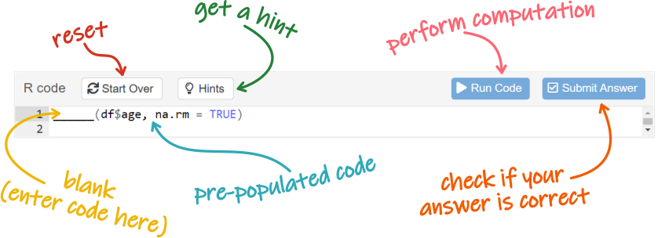

<base target = "_blank"> 

<style>
p.caption {
  font-size: 0.85em; 
}
</style>

```{r setup, include = FALSE}

library(learnr)
library(gradethis)
library(tidyverse)
library(gghalves)
library(effsize)
library(knitr)

all_data <- read.csv2("data/tutorial_data.csv") 

# set plot theme to slightly lighter gray 
theme_set(theme_bw() %+replace% 
            theme(panel.background = element_rect(fill = "gray97")))

# tutorial options
tutorial_options(
  # globally disable code completion
  exercise.completion = FALSE,
  # code running in exercise times out after 2 min
  exercise.timelimit = 120,
  # use gradethis for checking
  exercise.checker = gradethis::grade_learnr
)

# hide non-exercise code chunks
knitr::opts_chunk$set(echo = FALSE)
```


<a rel="license" href="http://creativecommons.org/licenses/by-nc-sa/4.0/"></a> This tutorial was created by Nuria Doñamayor and Lara Wieland, and is licensed under a <a rel="license" href="http://creativecommons.org/licenses/by-nc-sa/4.0/">Creative Commons Attribution-NonCommercial-ShareAlike 4.0 International License</a>.


## Data analysis with R tutorial

### Comparing the average BDI-II scores of patients and healthy controls

In this tutorial, you are going to analyze the data you have acquired over the past few days (aggregated with those of the past semesters).

Specifically, you will compare the **scores in the Beck Depression Inventory II (BDI-II)** (bdiSum) of a group of psychiatric patients to those of a group of healthy controls. You will go through all necessary steps to end up with a meaningful output that you can report in a scientific way.


```{r fig1, echo = FALSE, out.width = "90%", fig.align = "center", fig.cap = "Artwork from [@juliesquid](https://twitter.com/juliesquid) for [@openscapes](https://twitter.com/openscapes) (illustrated by [@allison_horst](https://twitter.com/allison_horst)), licensed under [CC BY 4.0](https://creativecommons.org/licenses/by/4.0/)"}

knitr::include_graphics("https://github.com/allisonhorst/stats-illustrations/blob/main/openscapes/environmental-data-science-r4ds-general.png?raw=true")

```


### How to use this tutorial

As you might imagine, the structure of these data analysis tutorials is similar to that of last week's tutorials. However, there are a couple of differences that we'll point out now. 

Once again, every subsection will start with some introductory information that might contain some [links](https://techterms.com/definition/hyperlink). Some of the links are there to help you out with concepts with which you might not be thoroughly acquainted, but crucially others will take you to further info you might want to use in tomorrow's presentation. So do check out the links as they might come in quite handy.

Since you're going to be analyzing the data you acquired, you're obviously going to have to do some coding. You are probably quite familiar with this already, but here's a reminder just in case. 

<div class = "exercise_instruction"> 

Coding exercises will be preceded by brief instructions. We have used a different font and color from the rest of the text so you cannot miss them. 

</div> 

```{r fig2, echo = FALSE, out.width = "75%", fig.align = "center"}



```

Exercises will contain pre-populated code with blanks that you need to fill in. Once you're done, you can "run" the code and see your results. Some of the exercises also include hints and/or have a specific correct answer, in which case you'll see those additional buttons. Keep in mind how your variables are called and feel free to label your plot axes as you prefer. 

<div class = "hot_tip">

**TIP**

You're already familiar with this kind of tips. There won't be a lot of these in this tutorial.  

</div>

<p></p>

<div class = "presentation_tip">

**PRESENTATION TIP**

But this tutorial also has a bunch of presentation tips.

These tips suggest topics and ask questions you might wish to consider when you prepare tomorrow's presentation. These are not things you must answer, just stuff you might want to think about. 

</div>

<p></p>

Finally, every once in a while you will get asked specific questions about your findings. 

```{r how-to-question}

question(

  "Aren't quizzes awesome?",

  answer("I'm going to ace all the questions!", correct = TRUE),
  answer("Oh, no, not again!"),

  allow_retry = TRUE,
  random_answer_order = TRUE,

  correct = "Of course you will!",
  incorrect = "Simply pay close attention to your results and you'll be fine!"

)

```

Fantastic, let's start with some info about the BDI-II!


### What is the Beck Depression Inventory II?

The [**BDI-II**](https://naviauxlab.ucsd.edu/wp-content/uploads/2020/09/BDI21.pdf) is a 21-item self-report questionnaire designed to assess depression severity.

In each of the 21 items, the participant is presented with four statements and asked to choose the one that best describes how they have been feeling in the past two weeks. Each statement has a possible score from 0 (e.g. *I am not discouraged about my future*) to 3 (e.g. *I feel my future is hopeless and will only get worse*). Higher BDI-II scores indicate increased depression severity.

The BDI-II has been translated to numerous languages, including German, and has adequate psychometric properties, i.e. high  [reliability](https://dictionary.apa.org/reliability) and [validity](https://dictionary.apa.org/validity), for clinical samples.


## Formulating your hypothesis

The first step when conducting an experiment is formulating a [**hypothesis**](https://dictionary.apa.org/hypothesis) that is both testable and [falsifiable](https://dictionary.apa.org/falsifiability). This initial query will drive your experimental design, decisions regarding recruitment etc.

Obviously, in this module, we took care of experimental design and recruitment for you. Still, you chose to compare the BDI-II scores of patients and controls, so you probably have some idea about why this could be interesting. Before you dive into data analysis, take a few minutes to consider what results you would expect, based on common sense and the clinical knowledge you acquired in this module.


<div class = "presentation_tip">

**PRESENTATION TIP**

Formulate a null hypothesis and an alternative hypothesis as shown [here](https://courses.lumenlearning.com/introstats1/chapter/null-and-alternative-hypotheses/) to use in your introductory slides.

</div>


## Reading and exploring the data

### Loading necessary packages

```{r fig3, echo = FALSE, out.width = "13%", out.extra = 'style = "float: right"'}

knitr::include_graphics("https://github.com/rstudio/hex-stickers/blob/main/PNG/tidyverse.png?raw=true")

```

Unless you are *only* going to use functions included in the base package (which is unlikely), the first step in every R script is to load the packages you are going to need. 

For these tutorials, we have already installed and loaded all required packages for you. At home, you'd have to use the function `install.packages()` first. Then, you'd have to load the packages using the following code.

```{r load-package, eval = FALSE, echo = TRUE}

# loading tidyverse also loads the packages tidyr, dplyr and ggplot2, which you need here
library(tidyverse)
# you'll need effsize to get the effect size of your t-test
library(effsize)
# you'll need gghalves to do some nice plotting at the end of the analysis
library(gghalves)
# you can generate simple but nice looking tables with knitr
library(knitr)

```

<div class = "hot_tip">

**TIP**

The code in these analysis tutorials is heavily commented. 

You should read the comments to understand what you're doing. And remember that some of them will also tell you how to fill in the blanks for the code to run! 

</div>


### Loading your data

Start by reading your dataset into R and then exploring the structure of the data.

<div class = "exercise_instruction"> 

Run the following code. Does everything look fine in your data frame?
    
</div>

```{r read-dataframe, exercise = TRUE, exercise.lines = 7}

# you need to use the read.csv2 function (instead of read.csv) because German csv files are semicolon-separated 
# with commas as decimal points
all_data <- read.csv2("data/tutorial_data.csv") 

# explore the structure of the data
str(all_data) 

```


###

```{r fig4, echo = FALSE, out.width = "70%", fig.align = "center", fig.cap = "Illustration from the [Openscapes](https://openscapes.org/) blog [Tidy Data for reproducibility, efficiency, and collaboration](https://openscapes.org/blog/2020-10-12-tidy-data/) by Julia Lowndes and [Allison Horst](https://twitter.com/allison_horst), licensed under [CC BY 4.0](https://creativecommons.org/licenses/by/4.0/) (modified)"}

knitr::include_graphics("images/allison_horst_tidydata_3_modified.png")

```

You are going to transform the variables "group" and "gender" into [factors](https://www.stat.berkeley.edu/~s133/factors.html). Factors are categorical variables in R, i.e. they take on a limited number of different values. Since categorical and continuous variables are treated differently by statistical models, defining your factor variables ensures that statistical functions will treat such data correctly.

<div class = "exercise_instruction"> 

Run this code to transform the variables into factors and then explore the data again. How does it look now?
    
</div>

```{r correct-dataframe, exercise = TRUE, exercise.lines = 10, warning = FALSE}

all_data <- all_data %>% 
  # transform group and gender into factors
  mutate(group = factor(group), 
         gender = factor(gender)) %>%
  # arrange in descending order of group
  arrange(desc(group)) 

# now explore the structure of the data again
______(all_data) 

```

```{r correct-dataframe-hint}

Try the function str()

```

```{r correct-dataframe-solution, exercise.reveal_solution = FALSE}

all_data <- all_data %>% 
  mutate(group = factor(group), 
         gender = factor(gender)) %>%
  arrange(desc(group)) 

str(all_data) 

```

```{r correct-dataframe-check}

grade_code("")

```


<div class = "hot_tip">
      
**TIP**
      
You are going to be seeing a lot of the "pipe" operator (**`%>%`**) again this week. Remember, it forwards a value or the result of an expression into the next function call or expression. 

</div>


### Extracting your data of interest

Your dataset has over 200 observations (subjects) and 33 variables. That's a lot more variables than you intend to analyze! You probably also noticed that some subjects have NA (not available) values. Therefore, it's probably a good idea to create a new dataset (**`my_data`**) containing only the subset of data you want to analyze.

<!-- prepare all_data and my_data for the subsequent exercises -->
```{r prepare-mydata}

all_data <- all_data %>% 
  mutate(group = factor(group, levels = c("PAT", "HC")),
         gender = factor(gender)) %>%
  arrange(desc(group)) 

my_data <- all_data %>% 
  select(group, subject, gender, age, BDI = bdiSum) %>%
  drop_na(BDI)

```

<div class = "exercise_instruction"> 

Run the code to create your `my_data` data frame and have R print it out.
    
</div>

```{r create-mydata, exercise = TRUE, exercise.lines = 7, exercise.setup = "prepare-mydata"}

my_data <- all_data %>% 
  # select group/demographic variables and the variable of interest
  # you are going to rename the variable of interest using a nicer/clearer name (cannot start with a number)
  select(group, subject, gender, age, BDI = bdiSum) %>%
  # remove subjects with missing values (NA) in your variable of interest
  drop_na(BDI)

```

```{r create-mydata-hint-1}

Remember that last week you learned of two options to print your data frame on the console

```

```{r create-mydata-hint-2}

You can either type the name of the data frame or enclose the whole expresion in parentheses

```

```{r create-mydata-solution, exercise.reveal_solution = FALSE}

# parentheses ----
(my_data <- all_data %>% 
  select(group, subject, gender, age, BDI = bdiSum) %>%
  drop_na(BDI))

# print ----
my_data <- all_data %>% 
  select(group, subject, gender, age, BDI = bdiSum) %>%
  drop_na(BDI)
my_data

```

```{r create-mydata-check}

grade_this({
  
  used_parentheses <- is.null(code_feedback(.user_code, .solution_code_all[["parentheses"]]))
  used_print <- is.null(code_feedback(.user_code, .solution_code_all[["print"]]))
  
  pass_if(used_parentheses, "Great job printing `my_data` using parentheses!")
  pass_if(used_print, "Great job printing `my_data`!")
  
  pass_if_equal(.solution_code_all)
  
  fail("Not quite right! Did you remember to print `my_data`?")
  
})

```


### Exploring your data of interest

You are going to explore **`my_data`** using both summary statistics and plots of your variable of interest. Since, as we mentioned last week, the commonly used [bar graphs](https://doi.org/10.1074/jbc.RA117.000147) and [boxplots](https://nightingaledvs.com/ive-stopped-using-box-plots-should-you/) aren't that great, you are going to try out some simple [alternatives](https://z3tt.github.io/beyond-bar-and-box-plots/). 

<div class = "exercise_instruction"> 

Start by making a strip plot and getting some summary stats. Does anything stand out?
  
</div>

```{r mydata-stripplot, exercise = TRUE, exercise.lines = 13, exercise.setup = "prepare-mydata"}

# make a strip plot
ggplot(data = my_data, aes(x = group, y = ______)) +
  # increase the size of the points and add some transparency (overlapping values will result in darker regions)
  geom_point(size = 3, alpha = .2)

# compute stats for your variable of interest
my_data %>% 
  # create separate values for group
  group_by(group) %>% 
  # compute summary stats - your columns will take the name you input left of the equal sign
  summarize(______ = mean(BDI), ______ = sd(BDI), 
            ______ = min(BDI), ______ = max(BDI))

```


###

You probably noticed there were some lighter points relatively far away from the darkest regions. These are *potential outliers*.

[**Outliers**](https://dictionary.apa.org/outlier) are data points that lie at an abnormal distance from the other values in your sample. You can define this distance in several different ways, but at least in the field of Psychology the most common is probably to consider any value above or below 3 standard deviations from the mean as an outlier. To find outliers defined in this way, you simply need to transform your values to [*z*-scores](https://dictionary.apa.org/z-score) and find those greater than ±3. 

Once you have identified those values, there are basically three things you can do with them:

- Remove the outlier case
- Transform the data (all the data, not just the outlier case)
- Change the value of the outlier case (obviously in a prespecified way, not just by some value you fancy)

For simplicity's sake, if you find any outliers in your data, you'll just remove the cases.


###

However, before dealing with outliers, you should deal with implausible values.  

What do we mean by implausible? Simply, values that cannot happen in real life, e.g. negative reaction times, percentages above 100, scores higher/lower than the maximum/minimum possible score in a certain test etc.

Obviously, to identify implausible values in your dataset, you first need to know the possible range of BDI-II total scores (hint: just multiply the [minimum/maximum possible score per question](https://naviauxlab.ucsd.edu/wp-content/uploads/2020/09/BDI21.pdf) by the number of questions). 

```{r implausible-values-question}

question(
  
  "Based on the values shown in `my_data_summary`, do your data contain any implausible values?",
  
  answer("Yes"),
  answer("No", correct = TRUE),
  
  allow_retry = TRUE
  
)

```

<!-- prepare my_data with no implausible values for the subsequent exercises -->
```{r prepare-mydata-noimplausible, exercise.setup = "prepare-mydata"}

my_data <- my_data %>%
  filter(BDI %in% (0:63))

```


###

<div class = "exercise_instruction"> 

Now run the code to check if you have any <span class = "exercise_instruction_nonitalicized">z</span>-scores greater than ±3 in your groups. Note that the first output corresponds to the patients and the second to the controls. 
  
</div>

```{r outliers-mydata, exercise = TRUE, exercise.lines = 17, exercise.setup = "prepare-mydata-noimplausible"}

my_data %>% 
  # get just the patient data
  filter(group == "PAT") %>% 
  # select the variable of interest
  select(______) %>% 
  # the function scale() transforms your values to z-scores
  scale() %>% 
  # sort the z-values in ascending order to find the extremes more easily
  sort()

# now do the same for the control group
my_data %>% 
  filter(group == "HC") %>% 
  select(______) %>% 
  scale() %>% 
  sort()

```


###

```{r outliers-question}

question(

  "Do you have outliers based on the *z*-score definition?",

  answer("Yes, in the patient group"),
  answer("Yes, in the control group", correct = TRUE),
  answer("Yes, in both groups"),
  answer("No"),

  allow_retry = TRUE,
  random_answer_order = TRUE

)

```


###

<div class = "presentation_tip">

**PRESENTATION TIP**

Why do you think you looked for outliers in each group separately?

</div>


###

As mentioned above, you are simply going to remove outlier cases.

<div class = "exercise_instruction"> 

Explore the code to remove your outliers and then fill in the blanks to obtain the same summary statistics as before. Any differences with respect to the previous calculations?
  
</div>

```{r mydata-nooutliers, exercise = TRUE, exercise.lines = 24, exercise.setup = "prepare-mydata-noimplausible"}

my_data <- my_data %>% 
  # you need to first "group" the data so that z-scores are calculated independently for each group
  group_by(group) %>% 
  # create a new variable 'z' containing all z-scores
  mutate(z = scale(BDI)) %>% 
  # "ungroup" the dataset
  ungroup() %>% 
  # the ifelse function takes the form (logical expression, value if condition met, value if condition not met)
  # e.g. ifelse(abs(z) > 3, NA, variable) is interpreted as "if your absolute z-value exceeds 3, 
  # substitute by NA, otherwise keep the variable value"
  mutate(BDI = ifelse(abs(z) > 3, NA, BDI)) %>% 
  # remove subjects with missing values in the column of interest
  drop_na(BDI) %>% 
  # delete the variable with the z-scores, since you don't longer need it
  select(-z)

# explore your data again
my_data %>% 
  # create separate values for group
  group_by(group) %>% 
  # compute summary stats
  summarize(mean = mean(______), sd = sd(______), 
            min = min(______), max = max(______)) 

```


###

<!-- prepare my_data with no outliers for the subsequent exercises -->
```{r prepare-mydata-nooutliers, exercise.setup = "prepare-mydata-noimplausible"}

my_data <- my_data %>% 
  group_by(group) %>% 
  mutate(z = scale(BDI)) %>% 
  ungroup() %>% 
  mutate(BDI = ifelse(abs(z) > 3, NA, BDI)) %>% 
  drop_na(BDI) %>% 
  select(-z)

```

<div class = "exercise_instruction"> 

This time, use a [jittered](https://ggplot2.tidyverse.org/reference/geom_jitter.html) strip plot to take a look at your clean data. How does it differ from your previous plot?
  
</div>

```{r mydata-nooutliers-stripplot, exercise = TRUE, exercise.lines = 4, exercise.setup = "prepare-mydata-nooutliers"}

ggplot(data = my_data, aes(x = group, y = ______)) +
  # jitter the points only on the x-axis, so they still show their actual values on the y-axis
  geom_jitter(width = .1, height = 0, size = 3, alpha = .2)

```


###

<div class = "hot_tip">

**TIP**

Even though your strip plot might still show points relatively far away from where most of them overlap, it is good practice to check for and remove outliers a single time (per criterion). Remember that the point of outlier detection is to deal with abnormally high or low values, not to get rid of data variability.

Also, you should certainly not be tempted to change or add outlier criteria a posteriori!

</div>


## Analyzing the data

```{r fig5, echo = FALSE, out.width = "75%", fig.align = "center", fig.cap = "Illustration from the [Openscapes](https://openscapes.org/) blog [Tidy Data for reproducibility, efficiency, and collaboration](https://openscapes.org/blog/2020-10-12-tidy-data/) by Julia Lowndes and [Allison Horst](https://twitter.com/allison_horst), licensed under [CC BY 4.0](https://creativecommons.org/licenses/by/4.0/)"}

knitr::include_graphics("https://cdn.myportfolio.com/45214904-6a61-4e23-98d6-b140f8654a40/209ee1eb-fd83-4e4c-9bed-82ae43b0f3e9_rw_1920.jpg?h=e57409fd5269656f2f4a4d9135cd18a4")

```

You are now ready to compare the BDI-II scores of patients and controls. 

To this end, you are going to use a **t-test**, which determines whether the means of two groups are equal to each other. The null hypothesis is that the two means are equal (patients = controls). The alternative hypothesis is that the two means differ (patients ≠ controls). 

The standard in R is [**Welch's t-test**](https://www.statology.org/welchs-t-test/), which is an adaptation of [Student's t-test](https://www.statology.org/two-sample-t-test/) that is more reliable with unequal variances and/or sample sizes.


###


### Calculating the descriptives

Start by calculating some descriptive statistics for your groups. In contrast to the previous code during data exploration, now you are also going to get some descriptives of the demographic characteristics of your group.

This time, you'll also use the **`kable()`** function of the package **knitr** (you can take a look at the documentation [here](https://bookdown.org/yihui/rmarkdown-cookbook/kable.html), if you wish). This function is a very simple table generator, but it still has a relatively large number of arguments for customizing table appearance.  

<div class = "exercise_instruction"> 

Fill in the blanks and run the code to get a table of your descriptive statistics.
  
</div>

```{r descriptives-ttest, exercise = TRUE, exercise.lines = 18, exercise.setup = "prepare-mydata-nooutliers"}

my_data %>% 
  # create separate values for each group
  group_by(group) %>% 
  # start by calculating the number of subjects
  summarize(N = n(),
            # calculate number of men (m), women (w) and unknown/other (k)
            n.men = sum(gender == "m"), n.women = sum(gender == "w"), n.other = sum(gender == "k"),
            # calculate mean and sd for age
            # since there are missing values, they need to be removed from the calculation with na.rm = TRUE
            # (otherwise the result would be NA)
            mean.age = mean(age, na.rm = TRUE), sd.age = sd(age, na.rm = TRUE),
            # calculate mean and sd for your condition of interest
            # since subjects with NA have already been removed, you don't need to define na.rm
            mean.______ = mean(______), sd.______ = sd(______)) %>% 
  # choose the number of decimal points you want to use for rounding with the 'digits' argument
  # the 9 table columns will be aligned to the left ("l")
  kable(digits = ______, align = rep("l", 9))

```

<div class = "hot_tip">

**TIP**

If you want, you can use the `col.names` argument in the `kable()` function to replace the column names with a vector of new, prettier names. Since each element in the vector is a character string, it can include letters, numbers, spaces etc. You just need to make sure that the length of the vector equals the number of columns of your table. 

Use this argument like this:

`col.names = c("This", "Table", "Needs", "Nine", "New", "Column Names", "To", "Be", "Cool")`

</div>


### 

<div class = "presentation_tip">

**PRESENTATION TIP**

How similar are your groups in size and demographic characteristics (gender, age)? 

How do you think this might impact clinical symptoms, if at all?

What do the descriptive statistics of the BDI-II scores tell you about depression severity in your groups?

</div>


### Performing the t-test

As you saw last week, the **`t.test()`** function takes the form `t.test(dependent variable ~ independent variable, options)`. With the argument `paired = FALSE` (actually, the default), you will compute an independent-samples t-test (two groups, one variable). For a paired t-test (one group, two time points or variables), you would need to set it to `paired = TRUE`.

It is good practice to also report the [effect size](https://dictionary.apa.org/effect-size), i.e. a quantitative measure of the magnitude of the tested effect. The larger the effect size the stronger the difference between your groups. [Cohen's *d*](https://dictionary.apa.org/cohens-d) is the usual effect size measure for t-tests. The function **`cohen.d()`** takes the same form as `t.test()`.

<div class = "exercise_instruction"> 

Run the code to perform the t-test and to calculate Cohen's <span class = "exercise_instruction_nonitalicized">d</span>.
  
</div>

```{r perform-ttest, exercise = TRUE, exercise.lines = 6, exercise.setup = "prepare-mydata-nooutliers"}

# perform the t-test
t.test(my_data$______ ~ my_data$group, paired = FALSE)

# calculate Cohen's d
cohen.d(my_data$______ ~ my_data$group, paired = FALSE)

```


### 

<div class = "presentation_tip">

**PRESENTATION TIP**

Do the results of the t-test confirm or reject the hypothesis you formulated at the beginning of the session?

You can check how to adequately report the results of a t-test [here](https://www.socscistatistics.com/tutorials/ttest/default.aspx), but don't forget to also report Cohen's *d*!

Do you think that the results of the t-test already give you information about the effect size? 

What conclusions can you draw from the results of your t-test about the depression severity of your groups?

Based on the results of your analysis, would you predict a similar result in another sample of healthy participants vs. patients with some particular psychiatric disorder (other than major depressive disorder)?

</div>


### Plotting the data

```{r fig6, echo = FALSE, out.width = "50%", fig.align = "center", fig.cap = "Artwork by [@allison_horst](https://twitter.com/allison_horst), licensed under [CC BY 4.0](https://creativecommons.org/licenses/by/4.0/)"}

knitr::include_graphics("https://cdn.myportfolio.com/45214904-6a61-4e23-98d6-b140f8654a40/9a306c0a-dac8-413d-ba2e-cc7fd4c4d5c8_rw_1920.png?h=c802991088a9623f1f7aa18c470797ee")

```

As a final step in your analysis, you want to plot your data in a nice, state-of-the-art fashion! 

As mentioned last week, while bar plots may seem like the go-to plot, they are known to have [numerous issues](https://doi.org/10.1074/jbc.RA117.000147) and should be avoided. You might recall that you plotted violin plots and summary statistics last week. You are going to go one step further this week and plot the data with a combination of violin and dot plots, showing both the [probability density](https://dictionary.apa.org/probability-density-function) of the data and the individual subjects' data points, respectively. Obviously, you are also going to plot the mean and error bars showing the standard error of the mean.

<div class = "exercise_instruction"> 

Fill in the blanks to plot your data.
  
</div>

```{r plot-ttest, exercise = TRUE, exercise.lines = 21, exercise.setup = "prepare-mydata-nooutliers", warning = FALSE, fig.dim = c(6, 5.5)}

ggplot(data = my_data, aes(x = group, y = ______, fill = group, color = group)) +
  # geom_half_violin shows the density curves of the data 
  geom_half_violin(side = "r", alpha = .5, color = "black", position = position_nudge(x = .2)) +
  # geom_jitter shows the jittered individual data points
  geom_jitter(width = .1, height = 0, size = 3, alpha = .4) +
  # plot the mean in black, overlaid on the density curves
  stat_summary(fun = mean, geom = "point", 
               color = "black", size = 4, position = position_nudge(x = .2)) +
  # plot error bars showing the standard error of the mean
  stat_summary(fun.data = mean_se, geom = "errorbar", 
               color = "black", linewidth = 1, width = .1, position = position_nudge(x = .2)) +
  # choose a different color palette than the standard
  scale_fill_brewer(palette = "Set1") +
  scale_color_brewer(palette = "Set1") +
  # choose a classic, black-and-white theme for the axes
  theme_classic(base_size = 20) +
  # remove the legend, which you don't really need for this plot
  theme(legend.position = "none") +
  # pick your axis labels
  labs(x = "______", y = "______")

```

<div class = "hot_tip">

**TIP**

This plot uses the `"Set1"` palette of the **RColorBrewer** package. Fell free to explore [other qualitative palettes](https://r-graph-gallery.com/38-rcolorbrewers-palettes.html) to color-code your figure.  

</div>


### 

<div class = "presentation_tip">

**PRESENTATION TIP**

Looking at the plot, are there any additional conclusions you can extract from your dataset and your analysis?

You can right-click on the image to save it for your presentation.

</div>


## Wrap-up

That's it, you analyzed real BDI-II data using a t-test!

If you want to try out a different analysis, check out the other scripts available in the *Files* tab.

We hope you had fun learning some R!

```{r fig7, echo = FALSE, out.width = "30%", fig.align = "center", fig.cap = "Artwork by [@allison_horst](https://twitter.com/allison_horst), licensed under [CC BY 4.0](https://creativecommons.org/licenses/by/4.0/) (modified)"}

knitr::include_graphics("images/allison_horst_heartyr_modified.gif")

```

<div style = "text-align: right; font-size: 1.2em; font-family: Indie Flower;">This tutorial was created by [Dr.rer.nat. Nuria Doñamayor](https://scholar.google.com/citations?user=MFJ3j-YAAAAJ&hl=es&oi=ao) & [M.Sc. Lara Wieland](https://scholar.google.com/citations?user=PB8KgtYAAAAJ&hl=es&oi=ao) ([AG Lernen und Kognition](https://psychiatrie-psychotherapie.charite.de/forschung/computational_neuroimaging/ag_lernen_und_kognition/))</div>


